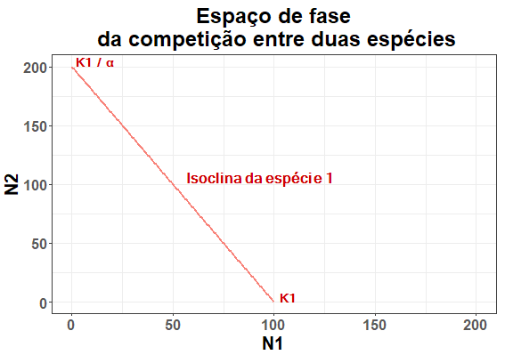
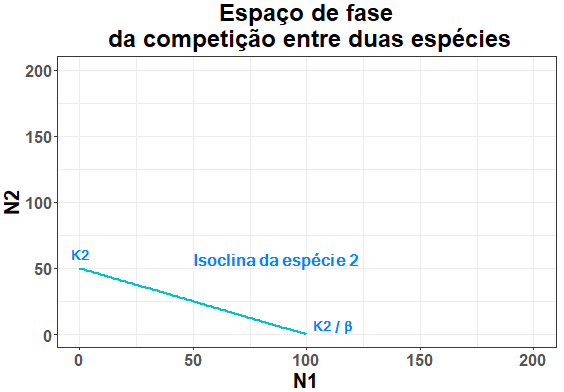
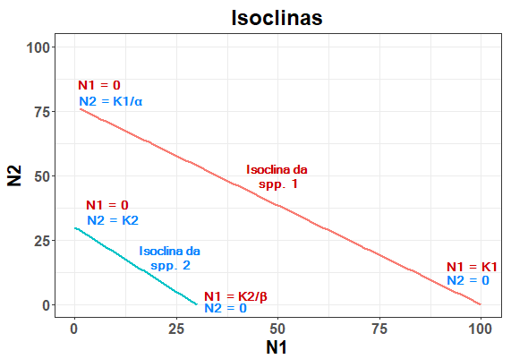
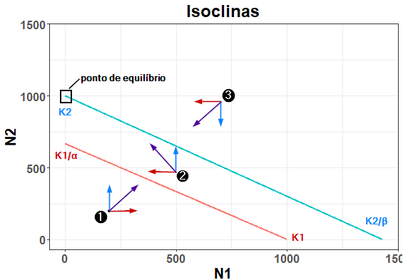
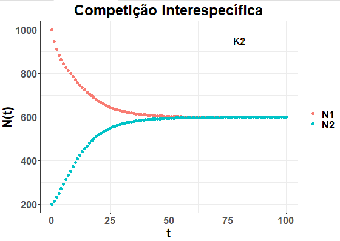
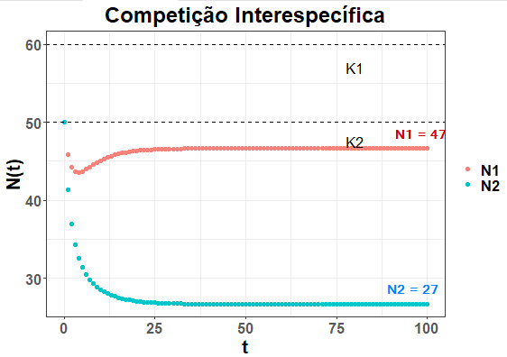

```{r setup, include=FALSE}
knitr::opts_chunk$set(echo = TRUE)
```

## Competição Interespecífica - Modelo de Competição de Lotka-Volterra

Este modelo representa a interação entre duas populações de espécies diferentes que competem entre si por um recurso limitante. Cada espécie sozinha cresceria de acordo com o modelo logístico, mas nesse caso sofre redução em seu crescimento de acordo com o número de indivíduos da espécie competidora e o tamanho do efeito que a competidora tem sobre sua população (coeficiente de competição).

<center>

$dN_1/dt=rN_1 \left(\frac{K_1-N_1}{K_1}\right)-αN_2$

e

$dN_2/dt=rN_2 \left(\frac{K_2-N_2}{K_2}\right)-βN_1$

</center>


A competição é caracterizada pelos seguintes parâmetros:

- $N_1$e $N_2$ -> os tamanhos das populações $1$ e $2$ 
- Coeficientes de competição $α$ e $β$ (alfa e beta) -> o efeito que a presença de cada indivíduo adicional de uma espécie tem sobre o tamanho populacional da outra
- $K1$  e $K2$  -> a capacidade de suporte de cada espécie

O **resultado da competição** é determinado apenas pelos valores de $N$, $K$ e pelos coeficientes de competição. As taxas intrínsecas de crescimento ($r_1$ e $r_2$) não afetam o resultado da competição, apenas a velocidade com que as mudanças no tamanho populacional ocorrem e o quão rápido se chega no resultado da competição.

### Premissas:

- Sozinhas, as populações cresceriam de forma denso-dependente, ou seja, na ausência da outra, teriam crescimento logístico até a capacidade de suporte (ainda estariam sujeitas à competição intraespecífica). Por isso incluímos as mesmas premissas já presentes no modelo logístico, como a limitação de recursos.
- Cada população tem sua taxa intrínseca de crescimento (r) e capacidade de suporte $K$ constantes. Os coeficientes de competição ($α$ e $β$) também são constantes.
- As duas espécies competem pelo mesmo recurso limitante, então o tamanho da população de uma espécie afeta o da outra. O efeito que o tamanho populacional que uma espécie tem sobre a outra é medido por uma constante, $α$ ou $β$ (alfa ou beta).
Essa competição frequentemente é assimétrica, ou seja, os efeitos da espécie 1 sobre a espécie 2 podem ser maiores do que os da espécie 2 sobre a espécie 1 ou vice-versa. Isso significa que frequentemente uma espécie é uma competidora mais forte do que a outra. No entanto, veremos mais à frente que não é apenas isso que define o resultado da competição.
- O efeito da denso-dependência é linear, ou seja: assim como no crescimento logístico, a adição de novos indivíduos diminui o crescimento per capita da população de forma linear.

### Coeficientes de competição 

Os coeficientes de competição nos dizem o efeito que os indivíduos de uma espécie têm sobre o crescimento da outra. 

- $α$ (ou $α_{12}$) -> efeito da espécie 2 sobre a espécie 1, ou simplesmente efeito da competição sobre a espécie 1
- $β$ (ou $α_{21}$) -> efeito da espécie 1 sobre a espécie 2 , ou simplesmente efeito da competição sobre a espécie 2 

Repare que na notação $α_{12}$ e $α_{21}$, o primeiro dígito se refere à espécie que sofre o efeito.

### Entendendo o modelo
Para entender, primeiro, vamos rever o modelo de crescimento logístico de uma única população:

<center>

$$dN/dt = r N \left( \frac{K-N}{N} \right)$$

ou

$$dN/dt = r N \left( 1- \frac{N}{K} \right)$$

</center>

Ou seja: a taxa de crescimento logístico da população em determinado ponto é o crescimento exponencialr multiplicado pela proporção da capacidade de suporte ainda não preenchida. Lembrando que esta não é a equação para calcular o tamanho populacional em um tempo t, mas sim a que define o modelo e descreve a curva no gráfico, nos dando a variação instantânea a cada ponto (ou intervalo de tempo muito pequeno).

Em um cenário de competição, além de cada população ter o crescimento limitado pelo preenchimento da capacidade de suporte, também sofre efeito da quantidade de indivíduos da população competidora.

Para uma espécie 1 competindo com uma espécie 2 , temos que:

<center>

$dN_1/dt=rN_1 \left(\frac{K_1-N_1}{K_1}\right)-αN_2$

</center>

Em que $α$ é quantos indivíduos da espécie $N_1$terão a menos a cada indivíduo da espécie $N_2$ presentes.

Se $α = 2$ , por exemplo, a população da espécie 1 terá o crescimento instantâneo determinado pelo modelo logístico menos duas vezes a quantidade de indivíduos da população $N_2$. Nesse cenário, um indivíduo da espécie 2 “equivale” a dois indivíduos da espécie 1, ocupando o espaço de dois indivíduos da espécie 1 em sua capacidade de suporte $K1$.


### Espaço de fase e suas isoclinas

Quando falamos de competição, é comum expressarmos a interação em um gráfico que combina o tamanho populacional de ambas as espécies ($N1$ e $N2$). Este gráfico é chamado de espaço de fase.

No espaço de fase, cada ponto representa uma combinação de número de indivíduos de $N1$ e $N2$.

Nesse gráfico, traçamos a isoclina de cada espécie: linha sobre a qual o crescimento populacional da espécie é igual a zero.

Os pontos dessa linha são combinações de $N1$ e $N2$ nas quais o crescimento populacional da espécie a que se refere é nulo.

Vamos olhar apenas para a isoclina da espécie 1. Esta linha, sobre qual o crescimento de $N1$ é zero, corta o gráfico em dois pontos: 

- No eixo x ($N1$): a capacidade de suporte da <span style="color:#f88279">**espécie 1**</span> ( $K1$ ), estado em que mesmo sozinha seu crescimento seria 0.
- No eixo y ($N2$):  $K1 /α$ -> número de indivíduos da <span style="color:#00c6ca">**espécie 2**</span> (valor de $N2$) em que estes ocupam toda a capacidade de suporte da espécie 1 ($K1$).

Ex:  $K1  = 100$ e $α = 2$

Como cada indivíduo da espécie 2 equivale a dois indivíduos da espécie 1, precisamos de $50$ deles para preencher a capacidade de suporte da espécie 1 ($K1$).


$$K1/α  = 100/2$$

$$K1/α  = 50$$ 

Entre os valores de N1 = K1 e N2 = K1/α, temos uma reta de combinações de valores de N1 e N2 que causam o mesmo efeito do crescimento populacional da espécie 1 ser igual a zero. Ou seja, são combinações de valores em que toda a capacidade de suporte da espécie 1 está preenchida por indivíduos dela mesma e da espécie competidora.

<center>
 
</center>

O mesmo é válido para a isoclina da espécie 2, mas nesse caso os pontos em cada eixo serão:

- Eixo y (N2) -> K2
- Eixo x (N1) -> K2/ β

<center>
 
</center>

### Em que parte do gráfico as populações estão crescendo ou decrescendo?
	
Lembre que cada ponto no gráfico é uma combinação de valores de $N1$ e $N2$. A isoclina é a linha formada pelo conjunto de pontos em que o crescimento populacional é igual a zero para determinada espécie.

#### Abaixo da isoclina

Olhando apenas para a espécie 1, quando olhamos para os pontos abaixo da isoclina (toda a área do gráfico abaixo dela), ainda não alcançamos uma combinação de valores de $N1$ e $N2$ em que o crescimento se torna igual a zero (pelo preenchimento da capacidade de suporte $K1$ por $N1$ e $N2$) e a população de $N1$ estará crescendo.

<center>

$N1 + N2α < K1$

</center>

Em outras palavras, os indivíduos das duas espécies somadas ainda não preencheram a capacidade de suporte $K1$. Lembrando que o total de indivíduos da espécie 2 precisa ser multiplicado por $α$ para sabermos a quantos indivíduos da espécie 1 equivalem no preenchimento da capacidade de suporte $K1$.

#### Acima da isoclina

Acima da isoclina, temos combinações de $N1$ e $N2$ que ultrapassam o preenchimento da capacidade de suporte da espécie 1 ($K1$), por isso $N1$ decrescerá.


$$N1 + N2α > K1$$


O mesmo é válido para a espécie 2 e sua isoclina.

### Como identificar de qual espécie é cada isoclina?

Lembre-se que a isoclina da <span style="color:#f88279">**espécie 1**</span> é a que possui uma extremidade no ponto N1 = K1, marcado sobre o eixo N1 (onde N2 = 0). O mesmo vale para a <span style="color:#00c6ca">**espécie 2**</span> e K2.

A extremidade que possui o coeficiente de competição (α ou β) diz respeito à competição com a outra espécie. Então K1/α fica sobre o eixo N2 (onde N1 = 0) e K2/β sobre o eixo N1 (onde N2 = 0).

K1/α e K2/β são pontos em que a capacidade de suporte de N1 ou N2 está totalmente preenchida pela competidora.	

Na imagem abaixo, vemos os valores nas extremidades de cada isoclina:

<center>



</center>

### Quem ganha a competição?

Para definir, pelo gráfico, qual espécie ganha a competição, é importante perguntarmos:

- Qual a isoclina de cada espécie?
- Qual é a dinâmica (se cada população está crescendo ou decrescendo) em cada área do gráfico?
- Qual o ponto que representa as condições iniciais (tamanho inicial das populações N1 e N2) e em que área se encontra?
- Qual o caminho que as populações percorrerão no gráfico a partir das condições iniciais até um ponto de equilíbrio?

### Resultados possíveis da competição

- Se as isoclinas não se cruzam: uma das espécies ganha a competição (com exclusão competitiva da outra)

Quando as isoclinas não se cruzam, a espécie cuja isoclina está acima ganha a competição, independente de em que área se encontra o ponto das condições iniciais. 

Ex: se a isoclina da espécie 2 está acima, o resultado final será K2 indivíduos da espécie 2 e 0 indivíduos da espécie 1.

Lembre-se que abaixo da isoclina de uma espécie, sua população cresce. Acima, a população decresce. Em vermelho temos a direção (se está aumentando ou diminuindo) da <span style="color:#f88279">**espécie 1**</span> (eixo x) e em azul, da <span style="color:#00c6ca">**espécie 2**</span> (eixo y).

A seta <span style="color:#52009e">**roxa**</span> representa o resultado vetorial da dinâmica entre as duas espécies em cada área.

<center>
 
</center>

Na área 1, ambas as populações estarão crescendo. 
Na área 2 a população N2 (eixo y) continua crescendo enquanto N1 (eixo x) já ultrapassou K1 e por isso está diminuindo. Consequentemente, N2 continuará crescendo até K2 e excluirá a população N1, cuja população chegará a 0.

Na área 3, ambas as populações começarão diminuindo, pois ambas estão acima da capacidade de suporte. O sistema entrará na área 2 e a população N2 atingirá sua capacidade de suporte, também excluindo a população N1. 

O gráfico abaixo mostra a população de cada espécie em função do tempo:

<center>
 
</center>

- Se as isoclinas se cruzam, temos duas formas diferentes de equilíbrio:

1) Equilíbrio estável (coexistência)
Quando as isoclinas se cruzam e as extremidades internas são os valores K1 e K2.

Não importa a área em que se inicie no gráfico, os vetores sempre apontarão para o ponto no centro onde as isoclinas se cruzam. Este é um ponto de equilíbrio, pois está sobre ambas as isoclinas e nenhuma das populações aumenta e diminui. Sobre este ponto, dN/dt = 0 para ambas as populações. 

O equilíbrio é estável porque não importa de onde parta o sistema (as condições iniciais), o resultado sempre será o mesmo. Se o sistema for perturbado (deslocado do ponto de equilíbrio), também retornará para o mesmo.


<center>
 
</center>

Abaixo temos um exemplo em que o sistema se inicia acima da isoclina de N1 (N1 começa diminuindo) e abaixo da isoclina de N2 (N2 começa crescendo), mas ambas as populações se estabilizam em um valor intermediário entre seu valor inicial e sua capacidade de suporte.

<center>
 
</center>

No exemplo acima, por acaso este valor é o mesmo (N1 = N2 = 600). No entanto, os valores final de N1 e N2 também podem ser diferente entre si:

<center>
 
</center>

2. Equilíbrio instável (exclusão competitiva – a espécie que vence a competição depende das condições iniciais)

Quando as isoclinas se cruzam e as extremidades externas são os valores K1 e K2.

<center>
 
</center>

Se a competição se inicia na área 1, ambas as populações estarão diminuindo. Na área 3 ambas as populações estarão crescendo. Ambos os vetores apontam para o ponto em que as isoclinas se cruzam (“para dentro”), o ponto de equilíbrio instável. O equilíbrio é instável pois se houver alguma flutuação que coloque o sistema nas áreas 2 ou 4, uma das espécies será excluída pela outra.

Se o sistema se iniciar ou flutuar para a área 2, a população N2 alcançará sua capacidade de suporte e a população N1 será extinta.

Se o sistema se iniciar ou flutuar para a área 4, a população N1 alcançará sua capacidade de suporte e a população N2 será extinta.

Por conta disso, K1 e K2 são pontos de equilíbrio estáveis do sistema. Qual deles será atingido dependerá das condições iniciais (se o sistema começar nas áreas 2 ou 4) ou de flutuações após o sistema ter atingido o ponto de equilíbrio instável (se começar nas áreas 1 ou 3).

OBS: apesar do sistema ter dois pontos estáveis possíveis em K1 e K2 (dois possíveis resultados da competição), o sistema como um todo se caracteriza pela existência do equilíbrio instável.

## Dicas para a construção do gráfico

- Identifique os eixos por escrito. A população N1 é sempre denotada no eixo x e a população N2, no eixo y.
- Trace a isoclina da espécie 1 (eixo x): lembre-se que a isoclina é o conjunto de pontos em que o crescimento da espécie 1 é igual a zero. Há dois pontos extremos em que isso acontece: 
   - K1 (capacidade de suporte da espécie 1), marcado sobre o eixo N1
   - K1/α, que é a quantidade de indivíduos da espécie 2 que ocupa toda a capacidade de suporte da espécie 1, a levando à extinção. Se refere a uma quantidade de indivíduos da espécie 2 e por isso é marcada no eixo N2.
- Trace a isoclina da espécie 2 segundo os mesmos princípios, mas utilizando K2 e K2/β.
- Escreva no gráfico a equação de cada isoclina, o que explica ao que cada linha se refere. Lembre-se, a isoclina abrange os pontos nos quais o crescimento da espécie é igual a 0. 

<center>

$dN1/dt=0$ 

e 

$dN2/dt=0$

</center>

- Marque o ponto das condições iniciais (combinação inicial dos valores de N1 e N2) e os vetores que partem daquele ponto (baseado em que área do gráfico o ponto se encontra).
      Lembre-se: abaixo da isoclina de uma espécie, sua população está crescendo. Acima, está decrescendo. Não se esqueça do vetor resultante (seta do meio, um pouco maior), que indica a direção do sistema quando se encontra naquela área.
- Represente os vetores de cada área, além do ponto inicial. 
- Identifique o resultado da competição e denote o(s) ponto(s) de equilíbrio. Baseado no vetor das condições iniciais e nos vetores de cada área do gráfico, qual dos possíveis pontos de equilíbrio será o resultado da competição?
   - K1, se a espécie 1 ganhar a competição (exclusão competitiva)
   - K2, se a espécie 2 ganhar a competição (exclusão competitiva)
   - Ponto em que as isoclinas se cruzam (quando todos os vetores resultantes apontarem para o centro) – ponto de equilíbrio estável (coexistência, equilíbrio estável)
   - Equilíbrio instável (exclusão competitiva)
          Quando um par de vetores aponta para o centro, mas outro par aponta cada um para uma capacidade de suporte.
          Se o ponto das condições iniciais estiver em uma área que aponta para o centro, teremos equilíbrio instável e não se sabe qual espécie ganhará a competição. Nesse caso, K1 e K2 são os dois possíveis pontos de equilíbrio estável e possíveis resultados da competição. 
          Se o ponto das condições iniciais estiver em uma área que aponta “para fora” em direção a uma das capacidades de suporte (ex: K2), esta espécie ganhará a competição e sua capacidade de suporte (K2) será o ponto de equilíbrio estável do sistema.
- Mostre o caminho, com uma seta, do ponto inicial até o resultado da competição.


#### Referências

GOTELLI, N. J. **Ecologia**. 4. ed. Londrina: Editora Planta, 2007

RICKLEFS, R.; RELYEA, R. **A Economia da Natureza**. 7. ed. Rio de Janeiro: Guanabara Koogan, 2016.