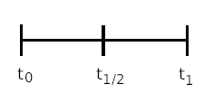

```{r setup, include=FALSE}
knitr::opts_chunk$set(echo = TRUE)
```

## Crescimento Exponencial - Explicação do modelo

### Premissas

-   Assim como no modelo geométrico, não há limitações ao crescimento da população, que pode crescer indefinidamente. Recursos como nutrientes e espaço não são limitantes.

-   As taxas de natalidade e mortalidade per capita ($B$ e $D$) não variam. Com isso, a taxa de crescimento da população (nesse modelo, $r$) também é constante.

-   O crescimento é denso independente por não depender da densidade da população.

-   A taxa de crescimento não varia com a quantidade de indivíduos existentes, nem há qualquer freio para o crescimento com o aumento da população.

-   Todos os indivíduos estão aptos a se reproduzir instantaneamente e com qualquer outro indivíduo da população.

### Definição matemática

Com base nas premissas acima, temos que o crescimento contínuo ocorre segundo a seguinte expressão exponencial: 
$$N_t = N_0e^{rt}$$

Esta equação nos diz o seguinte: para qualquer valor de $t$, o tamanho da população naquele tempo ($N_t$) é igual ao tamanho inicial em $t_{0}$ ($N_{0}$) multiplicado por $e$ (número de Euler) elevado a $r$ vezes $t$. 

Note que, pelas propriedades da potência, $e^{rt}$ (*e* elevado a [*r* vezes *t*]) é o mesmo que $(e^{r})^t$ ([$e$ elevado a $r$] elevado a $t$). Por isso, a cada passo de tempo, estamos multiplicando $N_0$ pelo termo $e^{r}$. (Assim como no modelo geométrico multiplicamos $N_{0}$ por $λ$ a cada passo.) 

Além disso, o quanto a população está crescendo em um determinado momento depende apenas do número de indivíduos já existentes $N$ e da taxa de crescimento instantânea (ou intrínseca) $r$. Representamos esse crescimento na forma de uma equação diferencial: 

$$dN/dt = rN$$

Esta é a derivada da função $N_t = N_0e^{rt}$ e é numericamente igual ao coeficiente angular (inclinação) da curva em qualquer ponto sobre ela. 

Note que $dN/dt$ é a notação da derivada, não se atribui valores para $dN$ nem $dt$. O $d$ representa uma variação. De modo simples, significa “a variação em $N$ a cada (pequena) variação em $t$”.

No contexto do crescimento populacional, o **valor da derivada** é o quanto a população está crescendo entre aquele ponto e um ponto muito próximo à direita (um intervalo de tempo muito pequeno). De forma simplificada, diz-se que é **o quanto a população está crescendo a cada ponto da curva**.


### O que é $e$ (número de *Euler*)?
	
A constante $e$ é a base do logaritmo natural, ou neperiano. 

A notação $ln_x$ é o mesmo que dizer $log_{e}x$, ou seja, logaritmo de $x$ na base $e$
.
Lembre-se que logaritmo é a operação que pergunta: “A que expoente devo elevar a base para chegar no número x?”. É a operação inversa da potência, operação presente nas funções exponenciais.

É matematicamente conveniente descrever funções exponenciais com base $e$ por uma série de relações matemáticas, como a de que suas derivadas são iguais a elas mesmas multiplicadas por uma constante.

$e$ é um número irracional, mas pode ser aproximado para:
$$e = 2,72$$

### A relação entre $r$, $R$ e $λ$

No modelo geométrico, temos a taxa de crescimento finita lambda ($λ = 1+R$), que é multiplicada a $N_0$ a cada passo de tempo.

$$N_t = N_0 λt$$

No modelo exponencial, o termo que multiplicamos a $N_0$ a cada passo de tempo é $e^r$.

$$N_t = N_0e^rt$$

Lembre-se que pelas propriedades da potência, $e^{rt}$ é o mesmo que $(er)t$  (leia-se $e$ elevado a $r$ elevado a $t$). Por isso, a cada passo de tempo, estamos multiplicando $N_0$ por $e^r$.

Podemos igualar $e^r$ a $λ$ e a partir daí estabelecer a relação eN_tre as taxas de crescimento nos dois modelos.

$$λ =e^r$$

E se calcularmos o logaritmo de ambos os lados, temos que:

$$ln(λ) = r$$

Então:

- se temos $r$ e queremos o valor de $λ$ correspondente, calculamos $e$ elevado a $r$;
- se temos $λ$ e queremos o valor de $r$ correspondente, calculamos o logaritmo de $λ$.
		
Ex:
$$r = 0,3$$

$$λ =e^r$$
$$λ = 0,3e$$
$$e = 2,72$$
$$λ = 2,72^{0,3}$$
$$λ = 1,35$$


### Tempo de duplicação

Uma forma de descrever o quão rápido uma população cresce é pelo tempo que leva até ela duplicar em tamanho. Quanto **menor** o tempo de duplicação, **mais rápido** é o crescimento.

Para calcularmos o tempo de duplicação basta igualar $N_t$ a $2N_0$ e resolver a equação para $t$.

$$N_t = N_0e^{rt}$$
$$2N_0 = N_0  e^{rt}$$

Dividimos por $N_0$ em ambos os lados:

$$2 = e^{rt}$$

Tiramos o logaritmo neperiano (base $e$) em ambos ao lados:

$$ln(2) = r  t$$
$$t = ln(2) / r$$

Temos que:
$$ln(2) =~ 0,6931471805...$$

Arredondando para duas casas decimais, podemos considerar $ln(2) = 0,69$.

$$t_{duplicação} = 0,69/r$$

Isso vale para qualquer população com crescimento exponencial contínuo e significa que o **tempo de duplicação depende apenas da taxa de crescimento intrínseca, r**, pois o numerador é uma constante ($ln(2)$).

### Comparação entre o crescimento geométrico e o exponencial

No crescimento geométrico (ou discreto), o tamanho da população em um tempo $t$ é definido por:

$$N_t = N_{0} λ^t$$

<center>
ou
</center>

$$N_t = N_{0}(1+R)^{t}$$

Pense no crescimento populacional que ocorre em $t_1$:

$$N_1 = (1+R)^1 N_0$$

Agora vamos ver o que acontece se esse crescimento ocorrer em dois sub-passos de tempo entre $t_0$ e $t_1$, ao invés de em um único passo ao final de $t_1$.

<center>



</center>

Teremos dois passos de tempo menores:

- $t0$ a $t1/2$ 

- $t1/2$ a $t1$


A mesma taxa de crescimento $R$ é dividida entre os dois:

$$N_1 = (1+ R/2)^2 N_0$$

Considere $N_0 = 100$ e $R = 0,4$:


**1)** No primeiro caso (normal do crescimento geométrico), o crescimento ocorre ao final de $t_1$:
      
$$N_1 = N_0(1+R)^1$$
$$N_1 = 100 (1+ 0,4)^1$$
$$N_1 = 100 * 1,4 $$
<center>
(crescendo  em  um  único  passo)
</center>

$$N_1 = 140$$


**2)** No segundo caso, o crescimento ocorre em dois sub-passos entre $t_0$ e $t_1$:

      
$$N_{1} = (1+ R/2)^2 N_0$$
$$N_{1} = (1 + 0,2)^2  100$$
$$N_{1} = 100 * 1,2 * 1,2$$
$$100 * 1,2 = 120 [1º passo]$$
$$N_{1} = 120 * 1,2 $$
$$120 * 1,2 = 144 [2º passo]$$
$$N_{1} = 144$$

No primeiro caso, os $100$ indivíduos se reproduzem uma única vez e geram mais $40$, totalizando $140$.
        
No segundo caso, a população se reproduz duas vezes naquele intervalo de tempo. Primeiro, os $100$ indivíduos geram mais $20$, que já estarão prontos para se reproduzir no próximo passo dentro do intervalo. No segundo passo, temos $120$ indivíduos se reproduzindo, gerando mais $24$. 

Consequentemente, a população chega a $t_1$ com $144$ indivíduos, ao invés de apenas $140$.

Repare que isto não é o mesmo que calcular $N_2$ , que teria um valor maior pela operação $N_2 = (1+R)^2 N_0$, pois no nosso cálculo o valor de $R$ também é dividido pelo número de passos (utilizamos $R/2$).

Se já temos essa diferença (quatro indivíduos a mais) dividindo um passo em dois, imagine se tivéssemos um número muito grande de passos de tempo ou infinitos passos entre $t_0$ e $t_1$. Teríamos a população se reproduzindo continuamente no decorrer do tempo, cada indivíduo adicionando outros à população imediatamente. Este é o caso do **crescimento exponencial** ou **contínuo**.

Quanto mais o número de passos entre $t_0$ e $t_1$ se aproxima de infinito, mais nos aproximamos ao quanto a população crescerá em crescimento exponencial

Vamos testar para 1000 passos:

$$N_1 = N_0 (1 + R/1000)^{1000} = 149,17$$ 

Este valor já é próximo do que obteríamos ao dividir o intervalo entre $t_0$ e $t_1$ em infinitos passos, que é, a grosso modo, o que o crescimento exponencial faz, pois ele considera o crescimento instantâneo dentro de intervalos muito pequenos.

Compare a diferença no crescimento quando se divide o intervalo entre $t_0$ e $t_1$ em diferentes números de passos:
        

|Número de passos entre $t_0$ e $t_1$|        Aplicação        no modelo geométrico |        Cálculo do valor com $N_0 = 100$ e $R = 0,4$  |  $N_1$  |
|---|---|---|---|
| $1$         |        $N_1 = N_0 (1+R)^1$                          |  $N_1         = 100 * 1,4$                         |                          $140$                     |
| $2$   |        $N_1        = N_0 (1+ R/2)^2$                                    |         $N_1         = 100 * 1,22$                         |                  $144$                     |
|        $1000$  |        $N_1         = N_0  (1 + R/1000)^1000$          |  $N_1         = 1000 * 1,00041000$           |                  $149,17$           |
| $∞$         | $lim_t-> ∞         (1 + R/t)^t$                        |                                                                                |                          $149,18$                   |

Quando dividimos o intervalo de $t_0$ a $t_1$ em um número que tende a infinitos passos, temos o quanto a população cresceria em crescimento exponencial contínuo.
<br>

#### Referências

GOTELLI, N. J. **Ecologia**. 4. ed. Londrina: Editora Planta, 2007

SANDERSON, G. **The Essence of Calculus**. Youtube, 28 abr. 2017. Disponível em: <https://www.youtube.com/watch?v=WUvTyaaNkzM>. Acesso em: 2 jul. 2022.

SANDERSON, G. **The paradox of the derivative | Chapter 2, Essence of calculus**. Youtube, 29 abr. 2017. Disponível em: <https://www.youtube.com/watch?v=9vKqVkMQHKk>. Acesso em: 2 jul. 2022.

SANDERSON, G. **What's so special about Euler's number e? | Chapter 5, Essence of calculus**. Youtube, 2 maio 2017. Disponível em: <https://www.youtube.com/watch?v=m2MIpDrF7Es>. Acesso em: 2 jul. 2022.

STEVENS, M. H. **A Primer of Ecology with R**. New York: Springer, 2009.
