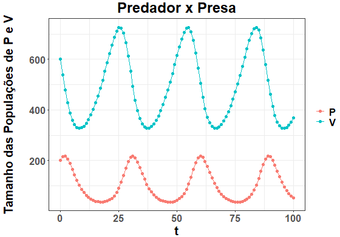
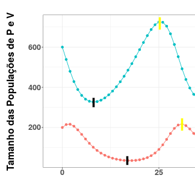
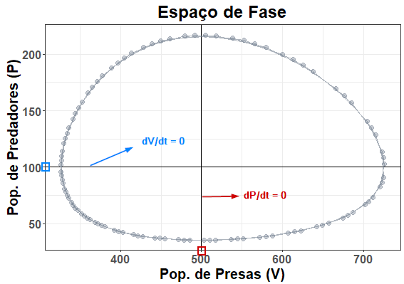
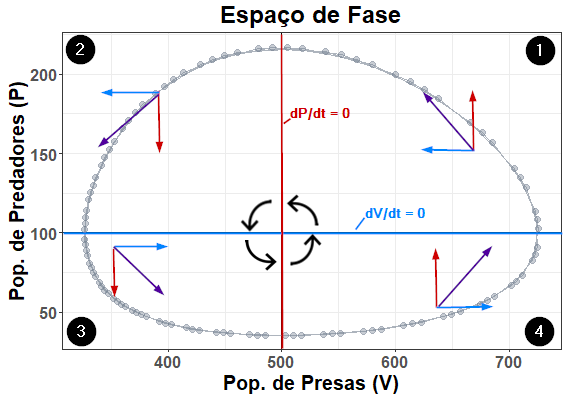

```{r setup, include=FALSE}
knitr::opts_chunk$set(echo = TRUE)
```

## Predação - Modelo de Lotka-Volterra

### Introdução
	
O modelo representa a interação entre duas espécies em uma relação de predação. Há uma população de presas, também chamadas vítimas, em crescimento que seria exponencial se não limitado pela presença de uma população de predadores, que constantemente remove presas de sua população. Os predadores são limitados por um único recurso, a abundância de vítimas, que afeta diretamente sua taxa de crescimento. A dependência do predador de cada vítima individual depende da taxa de conversão, sua capacidade de transformar a energia da vítima em novos predadores. 

As duas populações se encontram em um ciclo de crescimento e queda, com os picos da população de predadores ocorrendo um pouco depois dos picos da população de presas, das quais dependem. O aumento da população de presas faz a população de predadores disparar logo depois. Esse disparo então causa grande mortalidade de presas. Com pouca disponibilidade de presas, os predadores sofrem grande queda na população, que então possibilita a população de presas crescer novamente.

No ambiente, as duas populações afetam não só os números das outras diretamente, como indiretamente. Por exemplo, um número alto de predadores não apenas retira muitas vítimas de sua população, mas também pode limitar a reprodução de cada indivíduo por aumento do nível de estresse. O risco de predação diminui o próprio comportamento de procurar parceiros e acasalar, diminuindo a própria taxa de mortalidade per capita.

No modelo, as taxas de mortalidade e natalidade per capita da vítima são consideradas contantes e seu resultado é representado pela variável r (mantida constante em cada caso), assim como no modelo exponencial. A esta variável é acrescentada a mortalidade adicional pela predação. Para os predadores, a mortalidade é representada pela variável q (também constante) e a natalidade da população é alterada através de seus encontros com presas e eficiência de conversão.

### Premissas

- A população de presas (também chamadas de vítimas) teria crescimento exponencial na ausência do predador. Não há outras limitações para seu crescimento nem capacidade de suporte neste modelo.
- O predador é especialista, consumindo esta única população de presas. A população de predadores depende exclusivamente da população de presas para sobrevivência.
- Não há limite para o consumo de vítimas por cada predador. Não há fatores como saciedade e predadores não interagem entre si no contexto da predação.
- Os encontros entre predadores e vítimas ocorrem ao acaso segundo uma probabilidade constante.

### Definição matemática
	
**Crescimento da população de presas (vítimas)**
	
Assim como no modelo de crescimento exponencial, em que a variação do tamanho da população era denotado por dN/dt, aqui temos o crescimento populacional das vítimas como dV/dt. Ou seja, o quanto a população de vítimas está crescendo ou decrescendo em um intervalo muito pequeno de tempo.


$$\frac{dV}{dt} = rV – αVP$$


O termo rV é similar a rN e significa o quanto a população cresceria na ausência de predadores. O termo sendo subtraído é o impacto da presença dos predadores no crescimento da população de presas.

Lembre-se que r é a taxa de crescimento instantânea, resultante das taxas de natalidade e mortalidade instantâneas (b’ e d’), naturais da população independente da presença do predador. O predador se torna um fator de mortalidade extra, na forma do segundo termo. 

- r → taxa de crescimento intrínseca, ou instantânea, da população de vítimas
- α → eficiência de captura dos predadores
- V → tamanho da população de vítimas
- P → tamanho da população de predadores

A eficiência de captura é a chance de um predador que encontre uma vítima consiga capturá-la e consumi-la. É a medida do impacto que cada indivíduo de predador adicional tem sobre a população de presas.

Considerando encontros aleatórios constantes no tempo, temos a qualquer momento V vítimas encontrando P predadores. E nesses VP encontros, temos a chance α de que ocorrerá a predação. Logo, o número de vítimas predadas é αVP.
	
**Exemplo:**

| Parâmetro  | Valor    |
|--------------- | --------------- |
| V   | 100   |
| r  | 0,2   |
| P   | 5   |
| α   | 0,03   |

Em determinado ponto do tempo, a população de vítimas seria acrescida de rV indivíduos:

$$rV = 0,2 * 100 = 20$$

No entanto, temos presentes 50 predadores. Nesse mesmo intervalo curto de tempo, ocorrerão VP encontros entre predadores e vítimas:

$$VP = 100 * 5$$

$$VP = 500$$

Como a eficiência de captura do predador é 0,03, 3 a cada 100 ou 30% dos encontros resultarão em predação e morte da vítima:

$$αVP = 0,03 * 500$$

$$αVP = 15$$

Consequentemente, neste tempo, a população de vítimas ganhará 20 indivíduos por reprodução mas perdeu 15 indivíduos por predação.

$$\frac{dV}{dt} = 20 – 15$$

$$\frac{dV}{dt} = 5$$

Isso significa que, nesse ponto, a população de vítimas está crescendo, mas menos do que estaria na ausência do predador (aumentou em 5 indivíduos ao invés de 20).

**Crescimento da população de predadores**

O crescimento da população de predadores é denotado por dP/dt.

Neste modelo, o crescimento da população de predadores depende exclusivamente da captura de presas e da taxa de mortalidade do predador.


$$\frac{dP}{dt} = βVP – qP$$


- β→  eficiência de conversão de vítimas em novos predadores
- q→ taxa de mortalidade da população de predadores
- V→ tamanho da população de vítimas
- P → tamanho da população de predadores

A **eficiência de conversão** é o quanto cada encontro entre vítima e predador contribui para o crescimento da população de predadores. Nela está inclusa não só a eficiência de captura, mas a transformação de cada presa capturada em novos indivíduos da população de predadores.


**Exemplo:**

| Parâmetro  | Valor    |
|--------------- | --------------- |
| V   | 100   |
| q   | 0,1  |
| P   | 50   |
| β  | 0,01  |

Em determinado momento, a captura de presas adiciona predadores à população por:

$$βVP = 0,01 * 100 * 50$$

$$βVP = 0,01 * 500$$

$$βVP = 5$$

Ou seja: a cada 500 encontros predador x vítima (que ocorrem simultaneamente em determinado ponto do tempo), são adicionados 5 indivíduos à população de predadores (resultantes da captura e da transformação dessa captura em novos predadores por reprodução).

No entanto, os predadores morrem a uma taxa de mortalidade per capita fixa q:

$$qP = 0,1 * 50$$

$$qP = 5$$


Nesse curto intervalo de tempo, a população de predadores ganharia 5 indivíduos pela predação (βVP = 5) e perderia 5 indivíduos por sua taxa de mortalidade (qP = 5). Consequentemente, a população de predadores não cresceria neste momento.

$$\frac{dP}{dt} = 0$$


**Espaço de fase**

O espaço de fase é um tipo de gráfico que representa todos os possíveis estados de um sistema dinâmico. Aqui, o sistema em questão é a interação entre a população de predadores e a de vítimas e o gráfico mostra as possíveis combinações do tamanho de ambas as populações.

Cada ponto no espaço de fase é uma possível combinação do tamanho da população de predadores (P) e de presas (V). A população de <span style="color:#f88279">**predadores**</span> é comumente representada no <span style="color:#f88279">**eixo y**</span> e a de presas, no eixo x.

<center>


</center>

O gráfico abaixo representa os mesmos valores (tamanho da população de predadores e de presas) do espaço de fase acima, mas em função do tempo. 

<center>


</center>

Repare que a população de <span style="color:#00c6ca">**presas**</span> (vítimas) atinge seus picos (em <span style="color:yellow">**amarelo**</span> na imagem abaixo) e vales (em <span style="color:black">**preto**</span>) populacionais antes da população de <span style="color:#f88279">**predadores**</span>. Isso ocorre pois, com o aumento do número de presas, a população de predadores ainda demora algum tempo até que o ganho de indivíduos por predação volte a superar a taxa de mortalidade. O mesmo ocorre com a queda no número de vítimas, pois demora um pouco até que a taxa mortalidade do predador volte a superar sua natalidade em declínio (causada por menos encontros com vítimas).

<center>



</center>

### Isoclinas (ou isolinhas)

As isoclinas (ou isolinhas) são linhas no gráfico de espaço de fase que determinam a abundância das populações de predadores e presas em que o crescimento de cada espécie é igual a 0.

Como no modelo de competição, temos duas isoclinas. No entanto, no modelo de Lotka-Volterra para predação, é um número constante de indivíduos da outra espécie que mantém a espécie com crescimento dN/dt = 0 e as isoclinas de cada espécie são paralelas a seus eixos.

Ou seja: 

- A <span style="color:#00c6ca">**isoclina das presas**</span> se refere a um **número fixo de predadores** que as manteria com crescimento dV/dt = 0, independente do número de presas.
Corta o eixo y (dos predadores) e é paralela ao eixo x (das presas).
      
- A <span style="color:#f88279">**isoclina dos predadores**</span> se refere a um **número fixo de presas** que os manteria com crescimento dP/dt = 0, independente do número de predadores. Corta o eixo x (das presas) e é paralela ao eixo y (dos predadores).


<center>



</center>

**Em números:**


<span style="color:#00c6ca">**Isoclina das presas**</span>

- Corta o **eixo y** em $r / α$ (taxa de crescimento intrínseco da presa / eficiência de captura)
- No exemplo do gráfico acima: $r = 0,1$; $α = 0,001$.
	Nesse exemplo, a isoclina das presas corta o eixo y em $P = 100$.
	
<span style="color:#f88279">**Isoclina dos predadores**</span>

- Corta o **eixo x** em $q/β$   (taxa de mortalidade do predador / eficiência de conversão)
- No exemplo do gráfico: $q = 0,5$; $β = 0,001$.
	No exemplo acima, a isoclina dos predadores corta o **eixo x** em $V = 500$.


O **cruzamento das isoclinas** é um ponto em que ambas as taxas de crescimento são igual a 0.


$$\frac{dV}{dt} = 0$$

<center> e </center>

$$dP/dt = 0$$

A combinação dos valores de V e P oscila ao redor desse ponto (sem entrar em equilíbrio), em sentido **anti-horário**, de acordo com a posição relativa em relação às isoclinas.

### Comportamento do sistema nas áreas do gráfico

A população de presas cresce ou diminui de acordo com o número de predadores e vice-versa.

<center>



</center>

<span style="color:#f88279">**Isoclina dos predadores**</span>, que corta o eixo x no valor de V que mantém a população de predadores estável:

À direita (quando há mais presas), P aumenta. 

À esquerda (quando há poucas presas), P diminui.

<span style="color:#00c6ca">**Isoclina das presas**</span>, que corta o eixo y no valor de P que mantém a população de presas estável:

Abaixo (quando há poucos predadores), V aumenta. 

Acima (quando os predadores são muitos), V diminui.

**Quadrante 1:**

À direita da isoclina dos predadores (um valor de V), existem presas o suficiente para manter o crescimento maior que 0 e a população de predadores aumenta.

Acima da isoclina das presas (um valor de P), existem predadores excessivos que fazem a população de presas diminuir.

**Quadrante 2:** 

À esquerda da isoclina dos predadores (um valor de V), não há presas o suficiente para o crescimento da população de predadores e ela decresce.

Acima da isoclina das presas (um valor de P), o número de predadores é baixo o suficiente para a população de presas crescer.

**Quadrante 3:**

À esquerda da isoclina dos predadores (um valor de V), não há presas o suficiente para o crescimento da população de predadores e ela decresce.

Abaixo da isoclina das presas (um valor de P), o número de predadores é baixo o suficiente para a população de presas crescer.

**Quadrante 4:**

À direita da isoclina dos predadores (um valor de V), existem presas o suficiente para manter o crescimento maior que 0 e a população de predadores aumenta.

Abaixo da isoclina das presas (um valor de P), o número de predadores é baixo o suficiente para a população de presas crescer.


#### Referências

GOTELLI, N. J. **Ecologia**. 4. ed. Londrina: Editora Planta, 2007

RICKLEFS, R.; RELYEA, R. **A Economia da Natureza**. 7. ed. Rio de Janeiro: Guanabara Koogan, 2016.